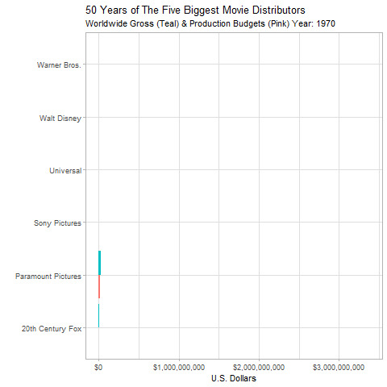
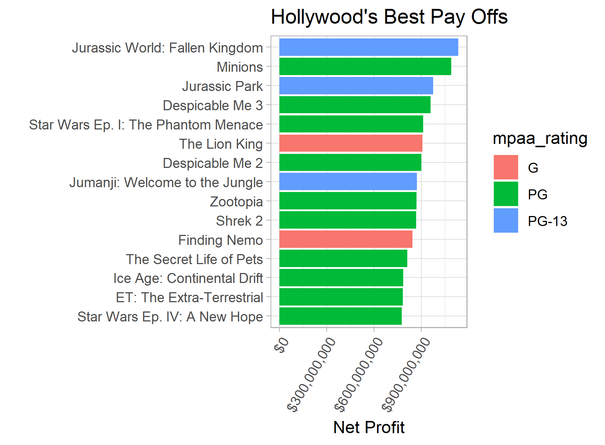
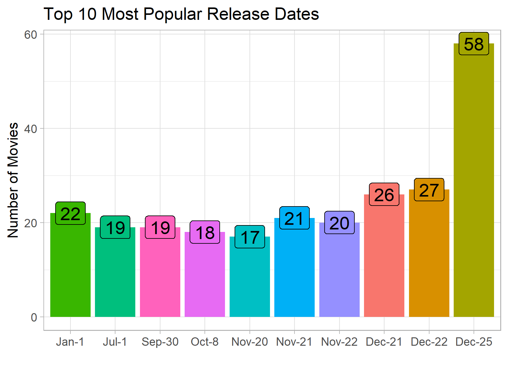

## Movie Analysis

### Motivation

As long as I can remember, movies have held an important place in my life, and in the lives of most people I have come across. There is hardly any corner of the world that has not been exposed to the likes of Star Wars, Harry Potter, Jurrasic Park, or what have you.

This lead me to dig a big deeper in to the the distributors and the industry's biggest successes. Let me share what I've found.

### Findings

The world's biggest distributors have grown significantly in the past 50 years both in terms of prodcution budgets and worldwide gross revenue.

A look at the most profitable movies.

The most popular date for movie releases is Christmas Day.

### Dependencies

- R and R packages:
  - tidyverse
  - lubridate
  - scales
  - plotly
  - gganimate
  - GridExtra
  
### Attribution

Article from [FiveThirtyEight](https://fivethirtyeight.com/features/scary-movies-are-the-best-investment-in-hollywood/)

Data from [the-numbers.com](https://www.the-numbers.com/)